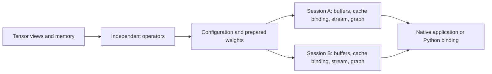

# Architecture

The dependency direction is `core -> operators -> runtime -> bindings`.
Operators can be built independently. The native runtime links CUDA and native
threads; Python, Torch and tokenization belong to optional consumers.

## Operators

`operators_core` provides portable non-owning views and inline reference
operations. `unified_operators` adds CUDA implementations and compatibility
adapters. Neither depends on a model or frontend.

Concrete CUDA buffer functions cover add, multiply, SiLU and RMSNorm.
`conditioning.hpp` provides float/BF16 linear projections and embedding sums
with borrowed weights, buffers, FP32 scratch, cuBLAS handle and stream.
These interfaces require no registry lookup, virtual dispatch or operand
allocation. CUDA launches and GEMM execution still have their ordinary costs;
end-to-end overhead and performance require measurement.

Fused kernels live beside primitives and declare layout and workspace
requirements. Validate a fusion against an unfused reference before replacing a
model call. Kernels in `operators/src/cuda/legacy/` remain necessary where
adapters still consume them.

## Qwen3 model and sessions

`Qwen3Model<T>` is prepared once on the current CUDA device. It owns configuration,
private uploaded weight storage, read-only RoPE data and resolved layer weight
descriptors. Required shapes and supported prepared layouts are checked during
construction. The source weight map can then be released. Sessions share the
model through `shared_ptr<const Qwen3Model<T>>`.

`Qwen3Session<T>` owns a nonblocking execution stream, cuBLAS handle, fixed
decode buffers, attention branch scratch, retained prefill arena, sampled-token
output and private CUDA graph resources. These allocations use direct owned
CUDA arenas, independent of process-global tags and the legacy prefill phase.
The compatibility inference engine skips global prefill reservation for this
executor.

The decoder is an explicit typed operator sequence in `qwen3_forward.cpp`:
embedding, attention norm/projections, Q/K norm and RoPE, KV write, attention,
output projection, residual, MLP, final norm and output head. Eager prefill and
decode use the same layer loop. There is no parallel execution IR, prepared-node
argument packing or per-node string lookup. Intermediate buffers are reused
across layers. Dense matmul retains a compatibility facade bound to the
session's cuBLAS handle; AWQ still uses existing kernel dispatch.

Decode buffers are reserved during session construction. Attention uses
caller-owned branch scratch. Prefill can grow a separate session arena after
previous work finishes. Returned logits borrow session storage and remain valid
until that session's next operation; they cannot outlive the owner.

The native engine supplies one `KVCache<T>` per executor. CUDA cache storage now
has private persistent arenas, including when another legacy caller has enabled
the global prefill phase. Logical resize/reset retains capacity. Qwen3 binds to
one cache and its backing addresses on first execution. Changed capacity,
replacement caches, invalid token IDs and incompatible dimensions are rejected
before model writes. Graph attention captures these addresses; changing only
copy destinations cannot rebind it. Use another session for another cache.

Graph capture remains a separate decode adapter. Fixed tensors have private
addresses, copy nodes are matched to actual K/V sources, and teardown completes
stream work before releasing memory. `set_graph_enabled()` or
`EDGE_INFER_ENABLE_QWEN3_GRAPH=1` selects graph decode for sampled `forward()`.
The logits APIs select their path explicitly: `forward_eager()` stays eager,
and `forward_for_graph_logits_only()` uses the graph adapter. Keep the bound
cache alive during all calls and finish outstanding work before destroying it.

Public Qwen3 operations complete GPU work before returning. Serialize calls on
one session. Synthetic regressions check interleaved eager/graph isolation;
the dense matmul test separately submits concurrent work using independent
handles and streams. Probabilistic sampling scratch still uses the global
allocator, so this validation does not establish simultaneous full generation
across sessions. The Python binding retains its single-session busy guard.

## Adding a model

A model defines configuration, weight mapping and operator sequencing. Reuse
operators when semantics and layouts match. Add a generic primitive with a
numerical reference when a concrete new architecture needs one. Dimension or
checkpoint-name variants should use configuration/mapping. Registration and
CMake entries remain explicit.

Qwen3 accepts token IDs and produces logits or sampled tokens. Speech needs an
embedding-to-hidden-state entry point, separate output heads and task-specific
cache lifetimes. Extract that common computation from validated implementations
when adding the next concrete model. A single `.cpp` addition is an extension
goal, not a guarantee for arbitrary architectures. Qwen2 and speculative
sampling retain legacy paths.

## Memory budgets

Batch-one dense KV bytes are
`2 * layers * context_capacity * kv_heads * head_dim * sizeof(dtype)`.
Decode scratch depends on a one-token shape; KV memory depends on context
capacity. Prefill has a separate arena and should eventually support bounded
prompt chunks. Budget shared weights plus each session's KV, intermediates and
auxiliary storage before selecting a session count.

The recorded 0.6B TTS talker uses 112 KiB per BF16 context position: 4096
positions reserve 448 MiB; 32768 positions reserve 3.5 GiB before weights and
scratch. Its five-layer code predictor needs at most 16 cached positions per
frame, or 320 KiB BF16 KV. Sequential talker/predictor scratch can share storage
when lifetimes are proven disjoint. More streams do not guarantee faster total
decoding; measure the chosen GPU and workload.

## Speech and bindings

`edge_infer::speech::QwenTtsConditioner<T>` implements native text projection
and audio-codebook embedding composition with aligned text. It borrows explicit
weights, buffers and execution resources. Torch is only a reference exporter.
The talker, per-frame code predictor, codec and waveform output remain to be
implemented and compared with the pinned reference.

Checkpoint loading/conversion and tokenization currently belong to the Python
frontend. The binding releases the GIL during generation, reacquires it for
callbacks and rejects overlapping generation or mutation. Native callbacks are
joined before return. These compatibility interfaces remain separate from
immutable weights and session execution state.

See [native integration](native-runtime.md),
[session validation](validation-qwen3-sessions-2026-10-04.md) and
[speech integration](speech-integration.md) for contracts and validation gates.
