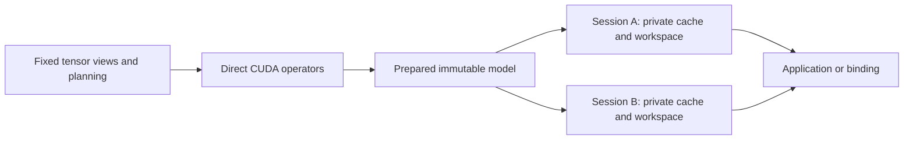

# Architecture

Dependencies flow from portable views and planning to operators, native runtime,
and optional bindings. The CUDA compute archive does not link the model runtime,
Python or Tensor ownership. Owning CUDA tensors use device-aware ordinary
allocations; there is no process-global memory pool.

## Compute interface

`TensorView<T, Rank>` is a trivially copyable pointer and fixed arrays of extents
and strides. It has no allocator, device dispatch, shared ownership or destructor.
Rank and scalar type are compile-time properties. Borrowing from the owning
`Tensor` is a validated boundary operation; layers only copy fixed views.
Unchecked inline view transformations require previously validated dimensions.

`operators/cuda/execution.hpp` contains borrowed execution resources, prepared
dense/AWQ weights and explicit operator calls. Preparation queries device limits,
resolves physical matrix layouts and queries sampling scratch size once. A decoder
submission binds its own cuBLAS handle once. Each operator launches a concrete
implementation, with no factory, registry, packed arguments or virtual dispatch.
Mixed dense/AWQ checkpoints retain the necessary weight-format branch.

`EdgeInfer::operators_cuda` contains computation only. Optimized kernel bodies
sit below concrete borrowed-view entry points; Tensor/factory adapters and their
CUTLASS dependency are preserved in Git history. The maintained build needs
CUDA/cuBLAS and C++17.

CUDA launches, validation, GEMM calls and library-managed workspaces still cost
resources. Zero-allocation steady submissions are a narrower contract than
zero end-to-end overhead or literal zero wasted memory.

## Shared storage and execution boundaries

The shared infrastructure manages storage and computation. A model supplies the
concrete sequence of operations and its state rules. Attention masks, positional
coordinates, modality packing, output heads, sampling and denoising schedules
remain model semantics; they are not inferred by a universal autoregressive loop.

A storage contract includes byte extent, scalar format, physical layout,
alignment, owner and lifetime. CPU, CUDA and pinned host allocations also need
explicit addressability and residency: a mapped host pointer is not a VRAM-resident
weight, and host pinning alone does not make a transfer complete. Borrowed views
describe the accessible layout while their owner preserves the backing storage.

Models declare fixed state or bounded dynamic state and workspace requirements.
Preparation resolves storage and execution resources within those bounds;
execution uses the resolved views. Immutable weights can be shared, while each
session or request owns mutable history, latents, scratch and progress. A future
shared residency cache needs its own synchronized owner rather than mutable state
hidden inside immutable weight descriptors.

Execution dependencies must cover CPU jobs, copies and CUDA kernels. A consumer
starts after its inputs are ready, and a buffer can be reused only after all its
readers and writers complete. Successful session calls complete before returning.
Future asynchronous paths must also drain outstanding jobs and transfers on
cancellation or failure before releasing their storage. These contracts do not
require a generic scheduler API; a concrete model sequence can express them with
bounded resources and explicit completion.

## Prepared model and session

`Qwen3Model<T>` copies validated checkpoint weights into private storage,
resolves layer descriptors once and prepares one FP32 RoPE sine/cosine table.
Sessions retain the shared immutable weights and table;
no shared ownership copies occur inside the operator loop. Optional Q/K norm
lets the same backbone execute Qwen2/Llama-style attention. `QwenModel` converts
its existing weight names once and delegates CUDA execution to this backbone.
Its FP32 CPU reference preserves the original compatibility interface. CPU
checkpoint admission takes a private snapshot of the caller's weights. Forked
CPU executors share that snapshot and each allocate independent mutable scratch;
forking does not copy the complete checkpoint again.

`Qwen3Session<T>` owns a stream, handle, decoder arena, sampling scratch/output,
prefill arena, graph state and optional managed KV cache. A managed cache reserves
exactly the requested context capacity:

`2 * layers * context_capacity * kv_heads * head_dim * sizeof(dtype)`.

KV tensors use fixed borrowed views. Legacy references are created lazily only
when requested, avoiding a descriptor for every layer/context position.
Independent sessions share weights and have independent mutable storage.

`create(model, capacity)` creates an empty session. `new_session(capacity)` shares
weights and starts another empty history. `prefill()` replaces history, `decode()`
appends a token, and `reset()` preserves the allocations for another history.
Context overflow, invalid token IDs and incompatible storage reject before model
writes. An execution failure attempts completion while preserving the original
exception. Confirmed completion clears the affected managed or external cache
history; begin again with prefill. Failed completion instead retains storage
and permanently invalidates execution, reset, graph changes and forks.
`synchronize()` can retry completion for cleanup but cannot revive the session.
Borrowed inputs and external caches must stay alive until completion is confirmed.

Logits are borrowed fixed views, valid until the next operation on that session.
Successful calls complete before returning; applications serialize each session.
External-cache compatibility binds to one cache and stable backing addresses;
its owner preserves the cache until the session has been destroyed. Python
`Model` prepares weights without a generation cache. Each `new_session(capacity)`
owns a private engine, forked executor and busy guard. The procedural Python API
wraps one session and replaces it only after successful initialization.

## One decoder and an offline memory plan

`execution/decoder.hpp` contains the concrete shared Qwen transformer sequence. Token
lookup, output heads and sampling are outside its embedding-to-hidden backbone.
Prefill, eager decode and graph capture all use that sequence, with explicit
logical RoPE positions and physical cache write slots. All three modes read the
same prepared RoPE table; eager calls provide a host offset and graphs read
device offset state. BF16 rotation preserves dtype rounding of trigonometric
values, products and their sum.

The gated MLP uses the independent `op::cuda::silu_multiply` primitive on the
session stream. One kernel replaces the separate activation and product launches
and writes in place to the gate buffer. It still rounds the SiLU activation to
the operand dtype before multiplying by the up projection, preserving BF16
staging without an additional allocation. This reduces one launch per layer;
end-to-end performance requires measurement.

The planner describes inclusive operation lifetimes for residuals, projections,
attention scratch and MLP intermediates. Dead values share storage. Preparation
allocates one arena and resolves offsets into typed views; execution never looks
up workspace names. The one-token layout remains fixed. Prefill grows a separate
arena only at a preparation boundary, and subsequent layers reuse that layout.
The plan exposes requested, unaliased and reused bytes for inspection.

Embedding-to-hidden prefill omits the vocabulary logits allocation. Token
prefill requests that output explicitly. Switching between these contracts
resolves a fresh layout even when the row count stays the same; an existing
arena retains its peak capacity for reuse. The decode arena still supports
both token and embedding calls.

CUDA Graphs capture the same decoder. Device offset state drives cache-store
kernels; there are no K/V memcpy nodes to patch, per-layer graph buffers or a
second string-based decoder. Attention reads the live device extent while K/V
views describe fixed backing capacity. Graph teardown waits for its stream.

Address stability is a property of a prepared session, not of every future
request. Repeated decode uses fixed pointers while token IDs, positions and
active lengths change in fixed control storage. A capacity or physical-layout
change requires a completed execution boundary and a new plan/capture. The
same direct sequence also runs eagerly; CUDA Graph is an execution optimization
over those storage contracts. Different sessions retain private mutable
addresses and graph state. Stable storage does not require computing every
unused slot in the reserved context capacity.

Sampling uses a prepared CUB plan and session-owned scratch. Temperature, top-k
and top-p have explicit semantics, including the sampled probability. Speculative
execution owns its scratch separately and performs exact greedy verification.
The native speculative API rejects `top_k != 1` before cache writes; Python routes
those requests to ordinary inference with independent target state.

Alignment, simultaneously live intermediates, retained peak prefill capacity and
CUDA-library-private memory remain in the budget. The current planner is a
reusable-slot allocator, not a proof of a globally minimal physical layout.

## Model extensions and speech

The storage and completion protocol is implemented once in the shared
infrastructure. Model code declares dimensions, layouts, bounded state and
intermediate lifetimes rather than implementing another allocator or ownership
system. Reuse follows concrete computation: compatible decoder variants use
the existing sequence, and new sequences call existing operators directly.

A checkpoint/name variant changes configuration and weight mapping. A new head
or embedding composition is a model adapter. An architecture requiring new
semantics adds the corresponding operator plus numerical validation. Adding an
arbitrary architecture cannot be guaranteed to require only one `.cpp` file.

MiniMax H3 illustrates the boundary. Its dense Omni Transformer repeatedly
processes a packed multimodal sequence with noncausal attention, three-axis
positions and per-row timestep/modality modulation. A request owns audio/video
latents and denoising progress; it does not append tokens to a generation KV
cache. Its future native implementation could reuse concrete operators and the
storage planner while defining its own execution sequence. H3 is not implemented
in `edge-infer`; see the [source-backed CPU/GPU research note](heterogeneous-inference.md)
for its stages, AdaLN cache and resource constraints.

The existing Qwen TTS conditioning stage supplies native text projection and
codebook embedding composition. The shared backbone exposes embeddings, hidden
states and independent position/cache offsets needed for future speech adapters.
Full TTS still requires MRoPE, talker and predictor heads, per-frame predictor
cache resets, the codec and waveform validation against the pinned source.

The harness chooses summaries, truncation and retrieved history. After changing
history, it prefills the resulting tokens. The runtime manages storage capacity,
positions and any future KV storage compression.

See [native integration](native-runtime.md), [speech integration](speech-integration.md)
and the validation records for measured scope.
