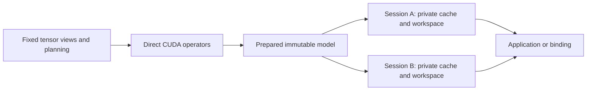

# Architecture

Dependencies flow from portable views and planning to operators, native runtime,
and optional bindings. The CUDA compute archive does not link the model runtime,
Python, Tensor ownership or the global memory pool.

## Compute interface

`TensorView<T, Rank>` is a trivially copyable pointer and fixed arrays of extents
and strides. It has no allocator, device dispatch, shared ownership or destructor.
Rank and scalar type are compile-time properties. Borrowing from the older
owning `Tensor` is a validated boundary operation; layers only copy fixed views.
Unchecked inline view transformations require previously validated dimensions.

`operators/cuda/execution.hpp` contains borrowed execution resources, prepared
dense/AWQ weights and explicit operator calls. Preparation queries device limits,
resolves physical matrix layouts and queries sampling scratch size once. A decoder
submission binds its own cuBLAS handle once. Each operator launches a concrete
implementation, with no factory, registry, packed arguments or virtual dispatch.
Mixed dense/AWQ checkpoints retain the necessary weight-format branch.

`EdgeInfer::operators_cuda` contains computation only. Historical Tensor/factory
adapters can be built explicitly with `EDGE_INFER_BUILD_LEGACY_OPERATORS=ON`;
the maintained runtime never links that archive. Existing optimized kernel bodies
are shared with the optional adapters through guarded host entry points. The
normal build needs CUDA/cuBLAS and C++17, without CUTLASS or Python.

CUDA launches, validation, GEMM calls and library-managed workspaces still cost
resources. Zero-allocation steady submissions are a narrower contract than
zero end-to-end overhead or literal zero wasted memory.

## Prepared model and session

`Qwen3Model<T>` copies validated checkpoint weights into private storage and
resolves layer descriptors once. Sessions retain a shared immutable model;
no shared ownership copies occur inside the operator loop. Optional Q/K norm
lets the same backbone execute Qwen2/Llama-style attention. `QwenModel` converts
its existing weight names once and delegates CUDA execution to this backbone.
Its FP32 CPU reference preserves the original compatibility interface.

`Qwen3Session<T>` owns a stream, handle, decoder arena, sampling scratch/output,
prefill arena, graph state and optional managed KV cache. A managed cache reserves
exactly the requested context capacity:

`2 * layers * context_capacity * kv_heads * head_dim * sizeof(dtype)`.

KV tensors use fixed borrowed views. Legacy references are created lazily only
when requested, avoiding a descriptor for every layer/context position.
Independent sessions share weights and have independent mutable storage.

`create(model, capacity)` creates an empty session. `new_session(capacity)` shares
weights and starts another empty history. `prefill()` replaces history, `decode()`
appends a token, and `reset()` preserves the allocations for another history.
Context overflow, invalid token IDs and incompatible storage reject before model
writes. A CUDA execution failure does not promise transactional KV contents.

Logits are borrowed fixed views, valid until the next operation on that session.
Public calls complete before returning; applications serialize each session.
External-cache compatibility binds to one cache and stable backing addresses;
its owner preserves the cache until the session has been destroyed. The Python
consumer still exposes one session with a busy guard.

## One decoder and an offline memory plan

`execution/decoder.hpp` contains the shared transformer layer sequence. Token
lookup, output heads and sampling are outside its embedding-to-hidden backbone.
Prefill, eager decode and graph capture all use that sequence, with explicit
logical RoPE positions and physical cache write slots.

The planner describes inclusive operation lifetimes for residuals, projections,
attention scratch and MLP intermediates. Dead values share storage. Preparation
allocates one arena and resolves offsets into typed views; execution never looks
up workspace names. The one-token layout remains fixed. Prefill grows a separate
arena only at a preparation boundary, and subsequent layers reuse that layout.
The plan exposes requested, unaliased and reused bytes for inspection.

CUDA Graphs capture the same decoder. Device offset state drives cache-store
kernels; there are no K/V memcpy nodes to patch, per-layer graph buffers or a
second string-based decoder. Attention reads the live device extent while K/V
views describe fixed backing capacity. Graph teardown waits for its stream.

Sampling uses a prepared CUB plan and session-owned scratch. Temperature, top-k
and top-p have explicit semantics, including the sampled probability. Speculative
execution owns its scratch separately; its distribution-correct rejection and
resampling algorithm remains experimental.

Alignment, simultaneously live intermediates, retained peak prefill capacity and
CUDA-library-private memory remain in the budget. The current planner is a
reusable-slot allocator, not a proof of a globally minimal physical layout.

## Model extensions and speech

A checkpoint/name variant changes configuration and weight mapping. A new head
or embedding composition is a model adapter. An architecture requiring new
semantics adds the corresponding operator plus numerical validation. Adding an
arbitrary architecture cannot be guaranteed to require only one `.cpp` file.

The existing Qwen TTS conditioning stage supplies native text projection and
codebook embedding composition. The shared backbone exposes embeddings, hidden
states and independent position/cache offsets needed for future speech adapters.
Full TTS still requires MRoPE, talker and predictor heads, per-frame predictor
cache resets, the codec and waveform validation against the pinned source.

The harness chooses summaries, truncation and retrieved history. After changing
history, it prefills the resulting tokens. The runtime manages storage capacity,
positions and any future KV storage compression.

See [native integration](native-runtime.md), [speech integration](speech-integration.md)
and the validation records for measured scope.
